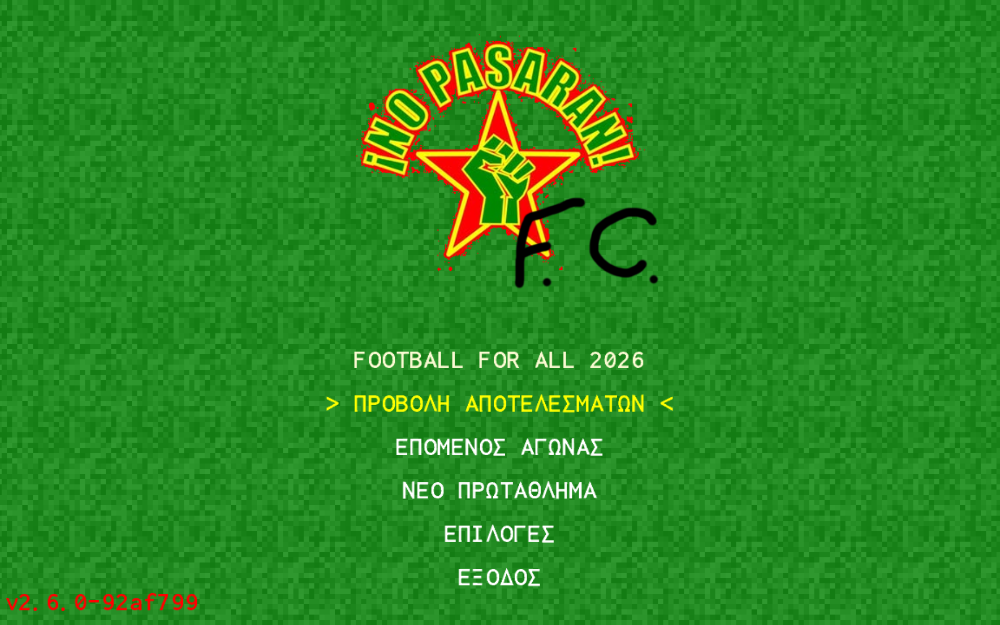
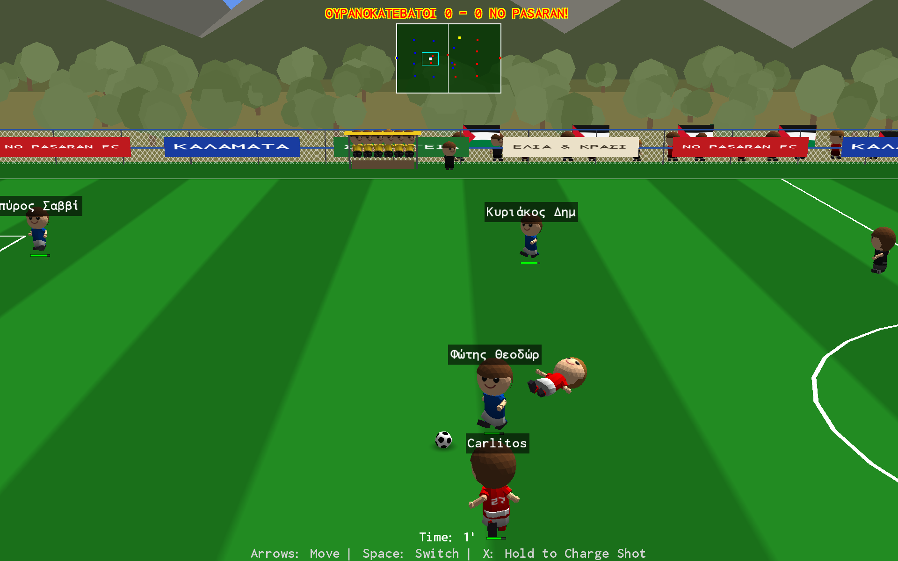
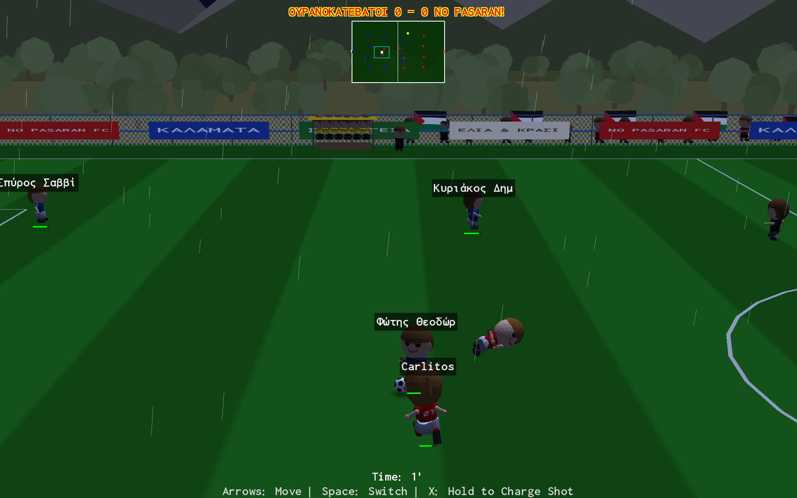
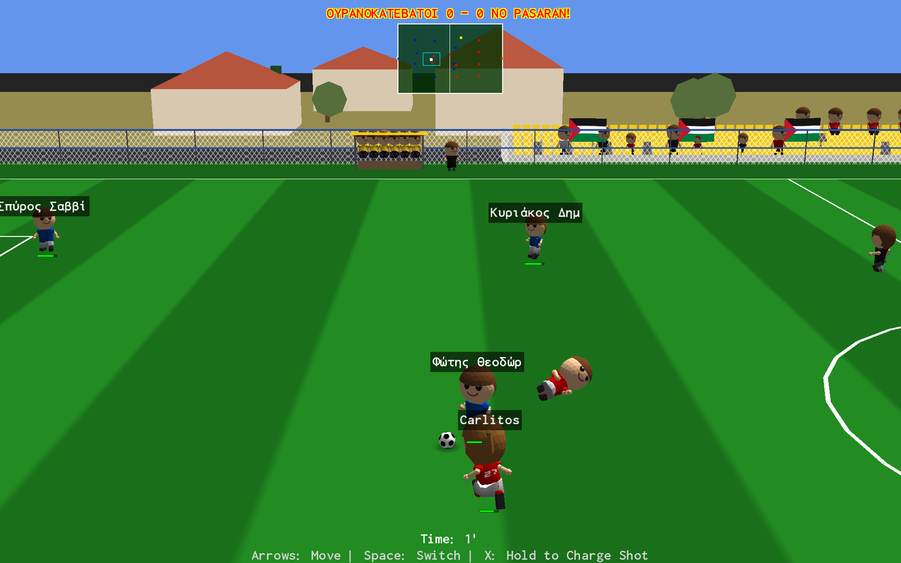
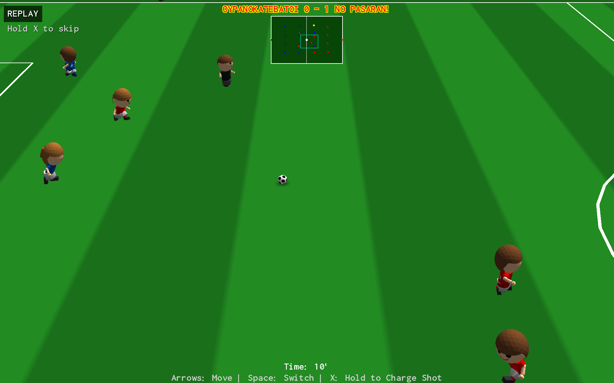
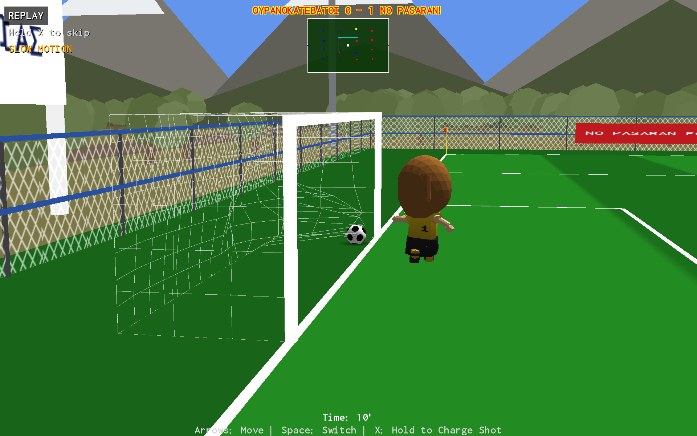
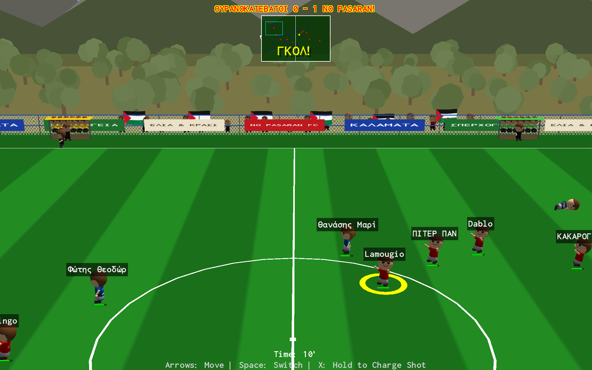
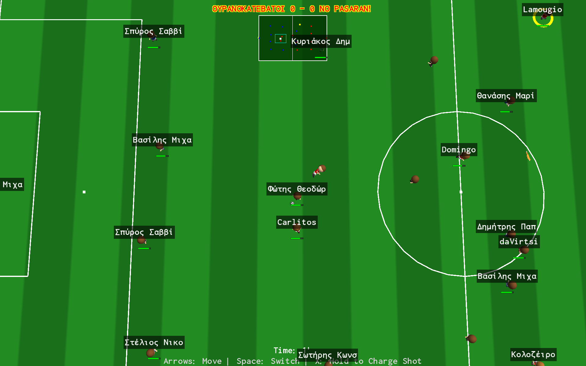
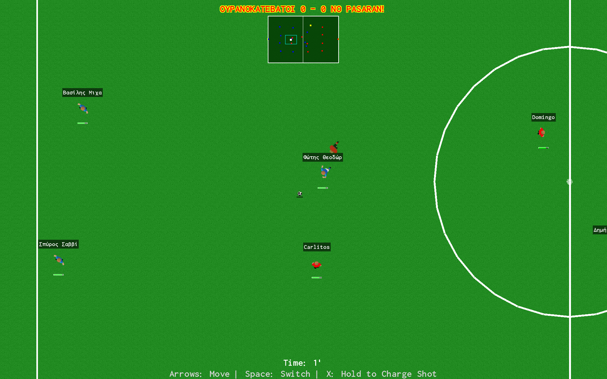

# NO PASARAN! Football Championship ⚽

A soccer game built with C# (.NET 9) and MonoGame 3.8, inspired by classics like Sensible Soccer — with a full **3D match view**: rigged, animated players, real venues, day/night, weather, and TV-style goal replays.

**Available on Windows, Linux, macOS, and Android!**



## Game Overview

Manage and play as **NO PASARAN!** in an 8-team championship. Control one player at a time while AI manages your teammates and opponents. Two match view modes, selectable in Settings:

- **3D** (default): perspective 3D view with skinned, animated players, municipal stadiums, animated fans, day/sunset/night lighting, rain, and slow-motion goal replays.
- **2D**: the original top-down sprite view (Sensible Soccer style), fully preserved.

### Teams
- **NO PASARAN!** (Player-controlled)
- BARTSELIOMA (ΜΠΑΡΤΣΕΛΙΩΜΑ)
- KTEL (ΚΤΕΛ)
- NONAME
- CHANDRINAIKOS (ΧΑΝΔΡΙΝΑΪΚΟΣ)
- ASALAGITOS (ΑΣΑΛΑΓΗΤΟΣ)
- ASTERAS EXARXION (ΑΣΤΕΡΑΣ ΕΞΑΡΧΙΩΝ)
- TIGANITIS (ΤΗΓΑΝΙΤΗΣ)

## 📸 Screenshots

### 3D mode — ΓΗΠΕΔΟ ΣΠΕΡΧΟΓΕΙΑΣ (Sperchogeia)
Olive grove ring, Taygetos backdrop, fence sponsor banners, floodlight pylons:



Night match in the rain:



### 3D mode — Παναγιώτης Μπαχράμης (Bahramis)
Yellow-seat stand with animated NO PASARAN! supporters waving Palestinian flags:



### Goal replays
Every goal is re-shown over the post-goal countdown: the build-up at 1.4x from a high sideline camera, then the payoff in 0.5x **slow motion** from a goal-side camera — with the cloth net deforming around the ball, exactly like the live goal. Hold X to skip.




### Goal celebrations
Scoring teams celebrate with distinct choreographed routines, the camera follows them, and the fans go wild:



### Camera modes & the classic 2D view
Broadcast / High / TopDown cameras in 3D, plus the original 2D sprite mode:




## ✨ Features

### 🎮 Core Gameplay
- **Championship Mode**: Full round-robin league season with all 8 teams, standings, round results, seasons
- **Two view modes**: full 3D (default) and classic top-down 2D, selectable in Settings
- **Ball Physics**: Velocity, friction, bouncing, and aerial trajectories (height simulated separately)
- **Tackle System**: Stat-based success probability with knockdowns
- **Goal Detection**: Goal-line crossing with crossbar/post ricochets
- **Cloth Nets**: Physics-based goal nets that deform on ball impact and sway in the wind
- **Set Pieces**: Throw-ins, corner kicks, goal kicks with charge aiming; proper last-touch detection
- **Match Simulation**: Realistic simulation of all non-player matches based on team strength
- **Stamina System**: Players tire during the match, affecting speed and performance
- **Difficulty System**: Easy/Normal/Hard affects AI reaction speed and accuracy
- **Match Duration**: Configurable 1-10 minutes
- **Local Co-op**: Player 2 can join mid-match (distinct indicators)

### 🏟️ 3D Mode
- **Rigged, animated players**: skinned GLB models (male + female bodies) with the KayKit clip library — running, walking, tackling, celebrations, knockdowns
- **Per-team kits**: shirt/shorts/socks recolored from the player atlas (luminance-normalized), back numbers, distinct goalkeeper kits
- **Two venues**, selectable in Settings:
  - **Παναγιώτης Μπαχράμης** — municipal ground with chain-link fence, yellow bucket-seat stand, scoreboard arch, trees and houses
  - **ΓΗΠΕΔΟ ΣΠΕΡΧΟΓΕΙΑΣ** — rural ground in an olive grove with the Taygetos ridge behind, sponsor banners on the fence, floodlight pylons, dirt road
- **Animated fans**: adults and children in team colors, seated and standing, waving Palestinian flags; they celebrate goals
- **Match atmosphere**: team benches with substitutes and animated coaches directing play, referee and linesmen, corner flags, easter-egg fox wandering the apron
- **Day/Sunset/Night + weather**: clear or rain (random by default), floodlights at night, environment-aware lighting on every object
- **Goal replays**: two-angle replay (high sideline build-up → slow-motion goal-side payoff) with cloth-net deformation, skippable
- **Celebration camera**: follows the celebrating players after every goal
- **Camera modes**: Broadcast / High / TopDown, with configurable zoom and follow speed

### 🧠 AI
- **Role-based behavior**: distinct logic for Goalkeepers, Defenders, Midfielders, Forwards
- **Dynamic passing**: pass corridor analysis, aerial passes to switch play, forward-progress bias
- **Smart dribbling**: ball shielding, sideline-aware attacking runs
- **Defensive coordination**: team-aware pressing and emergency goal protection
- **Anti-oscillation**: target inertia + start/stop hysteresis (no jittery state flipping)
- **Tuneable decision interval** (0.1-0.5s) in Settings

### 👥 Team & Player Management
- **Flexible Rosters**: Full squads (minimum 11, no upper limit)
- **Lineup Selection**: Pre-match screen with formation preview and stat display
- **Player Attributes**: Speed, Shooting, Passing, Defending, Agility, Technique, Stamina
- **In-game stat editing** via the debug console for gameplay experiments
- **JSON Seeding**: Load teams from `teams_seed.json` with UTF-8 support

### 🔊 Audio
- **Music**: Menu, match, and victory tracks — No Pasaran main theme ("Εμπρός Νό Πασαράν!") by comrade Kyriakos
- **Sound Effects**: Whistles, kicks, tackles, goals, crowd cheers
- **Volume Controls**: Separate music/SFX sliders, master mute

### ⚙️ Settings (all persisted)
- **Video**: Resolution, Fullscreen, VSync
- **Audio**: Master/Music/SFX volumes, mute
- **Gameplay**: Difficulty, match duration, player speed (0.5x-4.0x), AI decision interval
- **Display**: Minimap, player names, stamina bars
- **View**: 3D/2D mode, camera mode (Broadcast/High/TopDown), zoom, follow speed
- **Atmosphere**: Venue (Bahramis/Sperchogeia), time of day (Day/Sunset/Night/Random), weather (Clear/Rain/Random)
- **Language**: English / Ελληνικά (Greek default on first run)

### 💾 Data
- **SQLite persistence**: rosters, fixtures, results, standings, settings
- **Schema migrations**: settings DB upgrades automatically on update
- **New Season**: reset the championship while keeping teams

## How to Run

### Prerequisites
- **Desktop** (Windows/Linux/macOS): .NET 9.0 SDK
- **Android**: .NET 9.0 SDK with the Android workload, Android SDK, device or emulator

### Desktop
```bash
dotnet build NoPasaranFC.csproj
dotnet run --project NoPasaranFC.csproj
```
> Build the project, not the solution, unless you have the Android workload installed.

### Android
```bash
dotnet build NoPasaranFC.Android/NoPasaranFC.Android.csproj -t:Install -c Debug
```
Or use `clean-and-build-android.ps1` / `build-apk.ps1` on Windows. The APK can be sideloaded onto any Android device.

## 🎮 Controls

**Keyboard, Xbox-compatible gamepads, and touch (Android) are supported.**

### Menus
| Action | Keyboard | GamePad | Touch |
|--------|----------|---------|-------|
| Navigate | Up/Down Arrows | D-Pad / Left Stick | Virtual Joystick |
| Confirm | Enter | A / Start | A Button |
| Back | Escape | B | B Button |

### During Match
| Action | Keyboard | GamePad | Touch |
|--------|----------|---------|-------|
| Move Player | Arrow Keys | Left Stick / D-Pad | Virtual Joystick |
| Shoot (hold to charge) | X | A | A Button |
| Switch Player | Space | X | X Button |
| Skip celebration / replay | X (after 5s) | A | A Button |
| Pause/Exit | Escape | B | B Button |
| Player 2 join (local co-op) | Right Shift / Right Alt | — | — |

See **GAMEPAD_SUPPORT.md** for controller details.

## 📁 Project Structure

```
NoPasaranFC/
├── Models/             # Player, Team, Match, Championship, GameSettings, Localization, Version
├── Database/           # SQLite manager + JSON seeders
├── Gameplay/           # MatchEngine (pure simulation!), AI (UtilityAI/), celebrations, 2D camera, audio
├── Graphics3D/         # 3D renderer: Camera3D, World3D (venues), Ball3D, MatchRenderer3D,
│                       # PlayerAnimator, GoalNet3D, FanSection, TeamBench, MatchOfficials,
│                       # ReplayBuffer, MatchEnvironment, RainSystem, Skinning/ (GLB loader)
├── Screens/            # Menu, Match, Lineup, Standings, Settings, RoundResults, ...
├── Debugging/          # Debug TCP console, input seam, screen capture
├── Harness/            # Headless deterministic match simulation for AI evaluation
├── Content/            # Fonts, sprites, audio, Models3D/ (GLB + .blend sources)
└── NoPasaranFC.Android/
```

Key architectural rule: `MatchEngine` is pure 2D simulation (73 px = 1 m). The 3D renderer only reads engine state — never the reverse.

## 🔧 Debug Tooling

- **Debug TCP console** (`NOPASARAN_DEBUG=1`): screenshots, input injection, state dumps, ball teleport, player stat editing, match jumping. Client: `python3 Scripts/dbg.py "state" "shot /tmp/x.png 3"`
- **AI harness**: `dotnet run --project NoPasaranFC.csproj -- harness <scenario> --seconds N --seed 42 --out <prefix>` — headless deterministic matches with per-frame logs and trajectory plots (`Scripts/trajectory_plot.py`)
- **Blender pipeline**: `python3 Scripts/blender_exec.py <script.py>` runs scripts inside a running Blender (blender-mcp) for asset authoring

## 📝 Documentation

- **AGENTS.md**: project conventions, architecture rules, feature summary
- **GOAL_CELEBRATION_SYSTEM.md**, **BALL_OUT_SYSTEM.md**, **DIFFICULTY_STAMINA_SYSTEM.md**, **LOCALIZATION.md**, **GAMEPAD_SUPPORT.md**
- **AI_\*.md**: AI design and fix history
- Detailed design/fix documents live in the repo root

## 🚀 Current Status (v2.6.0)

**Fully playable on desktop and Android**, with the 3D view as the default experience.

Recent highlights:
- **v2.6.0**: ΓΗΠΕΔΟ ΣΠΕΡΧΟΓΕΙΑΣ venue (olive grove, Taygetos, sponsor banners, floodlights), venue selector in Settings; two-angle slow-motion goal replays with deforming nets
- **v2.5.0**: Attacking AI depth, referee waypoints, benches with animated coaches
- **v2.4.0**: Utility-AI rewrite, headless AI harness with trajectory plots, in-game stat editing
- **v2.3.0**: Team benches, match officials, cloth goal nets
- **v2.0.0**: Full 3D match view — skinned players, kits, Bahramis venue, fans, day/night, weather, celebrations
- **v1.2.0**: Android port with touch controls
- **v1.1.0**: AI state machine, aerial passing, match simulation, dynamic goal nets

## 🎯 Future Enhancements

- [ ] Penalty kicks (needs a foul system) and cards
- [ ] Offsides detection
- [ ] More venues; venue selection per home team
- [ ] Substitutions, transfers/training
- [ ] Tournament/knockout modes
- [ ] Detailed match statistics
- [ ] iOS support

## 👥 Credits

**Engineering**
- [tkleisas](https://github.com/tkleisas) — project creator & lead developer
- Stathis — goal celebration system
- [Kimi](https://www.kimi.com/code) (AI coding agent) — 3D match view, venues, skinned animation, replays, Blender asset pipeline, debug tooling

**Assets**
- [KayKit](https://kaylousberg.com) (CC0) — character skeleton & animation library
- [Khronos glTF Sample Models](https://github.com/KhronosGroup/glTF-Sample-Models) — the stadium fox
- Players, ball, and venue assets generated with [Blender](https://www.blender.org) via the blender-mcp pipeline

## License

This game is provided under an MIT License. The license text can be found in LICENSE.txt
